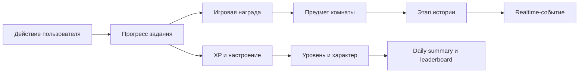
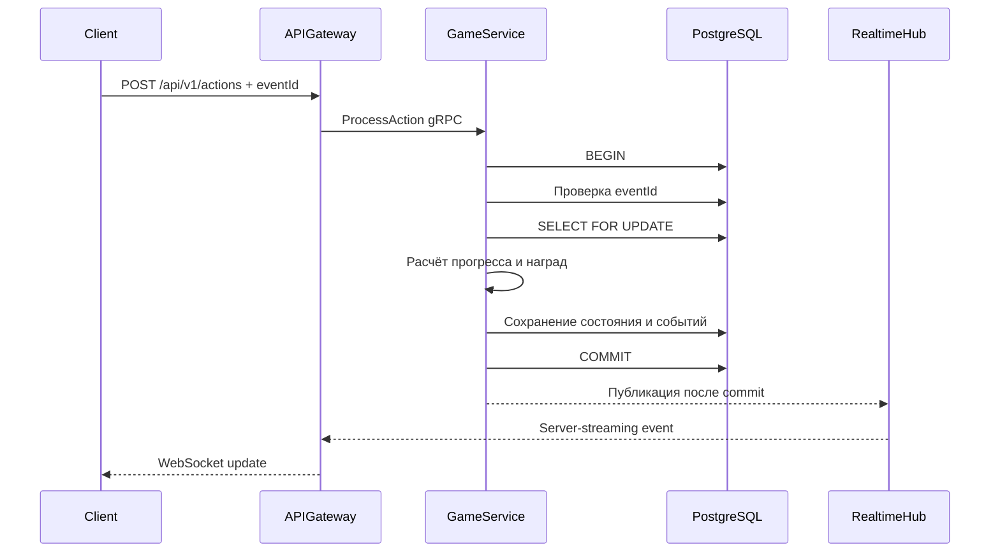
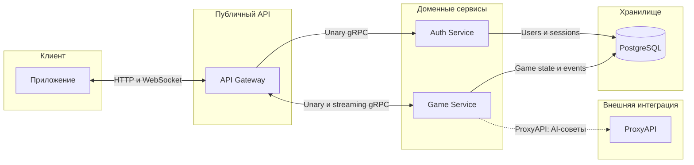

# Сергей Дудник — backend-вклад в Avitosha

Этот репозиторий показывает мою инженерную часть командного проекта Avitosha:
доменную модель, PostgreSQL, транзакционную игровую логику, REST/OpenAPI,
WebSocket, AI-интеграцию, gRPC-микросервисы, тестирование и оптимизацию.

Автор исходных backend-коммитов:

```text
Сергей Дудник
sergey <152873255+hhanqq@users.noreply.github.com>
```

В репозитории намеренно оставлены только:

- `backend/` — полные версии backend-файлов, которых касались мои коммиты;
- `README.md` — описание задачи, архитектуры и инженерных решений;
- `FILES.md` — подробная карта моего вклада по файлам.

## Коротко о результате

Я превратил базовую механику виртуального питомца в Avitosha v2 — полноценный
backend игрового продукта, связанного с реальными полезными действиями
пользователя.

Главный продуктовый цикл стал выглядеть так:



Вклад важен не только количеством реализованных функций. Я связал домен,
хранилище, API, realtime и инфраструктуру в один согласованный сценарий, где
данные не расходятся при ошибках, повторных запросах или конкурентном доступе.

## Что именно я реализовал

### 1. Спроектировал домен Avitosha v2

Я сформировал новую предметную модель:

- питомец с XP, уровнем, настроением, именем и характером;
- задания и пользовательский прогресс;
- действия пользователя с уникальным `eventId`;
- предметы комнаты и последовательная история `FIRST_ROOM`;
- дневной прогресс и недельный leaderboard;
- достижения и character scores;
- reward balances и аудит начислений;
- сохраняемые доменные события.

Это не набор независимых таблиц. Сущности объединены общими инвариантами:
действие может быть применено один раз, этапы истории открываются
последовательно, а награды соответствуют реально зафиксированному прогрессу.

### 2. Построил транзакционное ядро игры

Центральный сценарий `ProcessAction` выполняет в одной PostgreSQL-транзакции:

1. проверку уникальности события;
2. создание или загрузку игрового профиля;
3. блокировку изменяемого прогресса;
4. продвижение подходящих заданий;
5. расчёт XP, уровня и настроения;
6. открытие предметов и этапов истории;
7. обновление leaderboard, daily progress и характера;
8. начисление наград;
9. сохранение результата и доменных событий.



Такой подход обеспечивает атомарность: пользователь не может получить XP без
прогресса задания, награду без завершения этапа или WebSocket-событие об
изменении, которое затем откатилось.

### 3. Обеспечил идемпотентность и конкурентную безопасность

Каждое действие имеет уникальный `eventId`. Повторная отправка возвращает уже
сохранённый результат и не начисляет XP или награду повторно.

Для конкурентных запросов используются транзакции, уникальные ограничения и
блокировки строк. Я отдельно добавил тесты на:

- два одновременных запроса с одним `eventId`;
- параллельное продвижение одного задания;
- отсутствие lost update;
- однократное открытие награды и этапа истории;
- корректный rollback при ошибках.

Это особенно важно для событийной интеграции: повторная доставка — нормальная
ситуация, а не исключение. Backend должен безопасно принимать retry.

### 4. Реализовал REST API и OpenAPI-контракт

Я добавил игровые endpoint'ы, transport DTO, проверку входных данных, стабильные
ошибки и OpenAPI-описание для:

- профиля питомца;
- заданий и отдельных task details;
- обработки действий;
- комнаты и истории;
- дневной сводки;
- leaderboard;
- достижений;
- reward balances;
- AI-советов;
- WebSocket-подключения.

Контрактный подход снижает риск расхождения между реализацией и потребителями.
OpenAPI проверяется тестами, а domain errors преобразуются в предсказуемые
HTTP-коды.

### 5. Добавил realtime через WebSocket

После успешной транзакции backend публикует события:

- обновление и завершение задания;
- начисление XP и повышение уровня;
- смену настроения;
- открытие предмета комнаты;
- завершение этапа и истории;
- изменение leaderboard;
- получение достижения или характера;
- начисление игровой награды.

Hub имеет ограниченные клиентские буферы. Медленный клиент отключается и не
блокирует обработку пользовательского действия. Это важное эксплуатационное
решение: realtime-канал не должен замедлять основную бизнес-транзакцию.

### 6. Добавил безопасные AI-советы

Я интегрировал генерацию коротких советов через ProxyAPI. При этом AI вынесен
за пределы критической игровой логики:

- модель получает только минимальный контекст задания и питомца;
- email, access token и пользовательские сообщения не передаются;
- ответ ограничивается и валидируется;
- timeout, ошибка провайдера или некорректный ответ приводят к локальному
  безопасному fallback;
- AI не рассчитывает XP, прогресс, награды или баланс.

Это делает интеграцию полезной для продукта, но не превращает внешний AI-сервис
в точку отказа игрового backend.

### 7. Разделил backend на gRPC-микросервисы

Я провёл архитектурный аудит и разделил монолит по бизнес-ответственности:



Границы сервисов:

- API Gateway отвечает за публичный transport и не выполняет SQL;
- Auth Service владеет регистрацией, сессиями и токенами;
- Game Service владеет игровым доменом, наградами, AI и событиями;
- внутренний контракт версионирован через protobuf;
- deadline и cancellation проходят от HTTP до gRPC и PostgreSQL;
- доменные ошибки стабильно отображаются между слоями;
- readiness использует стандартный gRPC Health Checking Protocol.

Разделение сделано по владению данными и бизнес-функциями, а не просто по
техническим папкам. Поэтому сервисы можно развивать и масштабировать независимо,
не меняя публичный API.

### 8. Оптимизировал горячий путь на основе профилирования

Вместо предположений я добавил benchmark и снял профиль сериализации событий.
Проблемой оказалось лишнее преобразование:

```text
json.RawMessage → map[string]any → JSON
```

После перехода к проверяемому объединению JSON payload результат benchmark:

| Метрика | До | После | Улучшение |
|---|---:|---:|---:|
| Время | 26 428 ns/op | 18 480 ns/op | 30,1% быстрее |
| Память | 11 798 B/op | 6 149 B/op | 47,9% меньше |
| Аллокации | 272 | 44 | 83,8% меньше |

Формат API и WebSocket-событий при этом не изменился. Это показывает мой
подход к производительности: сначала измерение, затем локальное изменение и
обязательная проверка обратной совместимости.

## Почему эти решения сильные

| Решение | Инженерная ценность |
|---|---|
| Одна транзакция на игровое действие | Не допускает частично сохранённого прогресса |
| Идемпотентность по `eventId` | Делает retry и повторную доставку безопасными |
| Row locking и ограничения БД | Защищают от гонок на уровне источника истины |
| События после commit | Клиент видит только реально сохранённое состояние |
| Domain/usecase/repository boundaries | Правила отделены от transport и SQL |
| OpenAPI и protobuf contracts | Уменьшают связанность и риск несовместимых изменений |
| AI fallback | Внешний провайдер не ломает основной продукт |
| Ограниченный AI-контекст | Снижает риск передачи чувствительных данных |
| gRPC health/deadlines/cancellation | Улучшает управляемость распределённой системы |
| Benchmark-driven optimization | Производительность улучшается измеримо, а не интуитивно |
| Конкурентные и сквозные тесты | Проверяют реальные отказные сценарии, а не только happy path |

## Почему мой вклад важен для продукта

Моя часть формирует центральный путь Avitosha: от действия пользователя до
сохранённого прогресса и видимой игровой реакции. Именно этот слой превращает
визуальную идею питомца в работающий продукт с понятными правилами и надёжным
состоянием.

Ключевая ценность вклада:

- продукт получил не демонстрационную заглушку, а согласованную доменную модель;
- критические начисления защищены от дублей и гонок;
- realtime связан с подтверждёнными транзакциями;
- API формализован и покрыт контрактными тестами;
- архитектура подготовлена к разделению ответственности и масштабированию;
- AI добавлен безопасно и не влияет на корректность основной логики;
- производительность подтверждена воспроизводимыми измерениями;
- сложные сценарии закреплены тестами, включая concurrency и полный путь комнаты.

Инженерная сила этой работы — в системности. Я работал не только на уровне
отдельных endpoint'ов: проектировал инварианты, транзакционные границы,
контракты, модель отказов, realtime-доставку, наблюдаемую производительность и
эволюцию архитектуры.

## Мой инженерный подход

В этой работе последовательно применены принципы:

1. **Сначала инварианты.** Определить, какие состояния допустимы и что должно
   изменяться атомарно.
2. **База данных — источник истины.** Конкурентная корректность обеспечивается
   не только проверками в памяти, но и транзакциями, locks и constraints.
3. **Контракт важнее конкретного transport.** Публичный REST сохранился даже
   после перехода внутренних связей на gRPC.
4. **Побочные эффекты — после commit.** Realtime не сообщает клиенту о
   незафиксированном результате.
5. **Внешние сервисы должны деградировать безопасно.** AI имеет timeout,
   валидацию и fallback.
6. **Оптимизировать только после измерения.** Изменения производительности
   подтверждены benchmark и профилированием.
7. **Тестировать риски.** Основной акцент сделан на повторных запросах,
   конкуренции, rollback и сквозных сценариях.

## Карта файлов

Подробное описание роли каждого перенесённого файла и моей реализации находится
в [FILES.md](FILES.md).

Основные точки входа:

- [game_service.go](backend/internal/usecase/game_service.go) — главный игровой
  use case;
- [game_repository.go](backend/internal/repository/postgres/game_repository.go) —
  транзакционная граница;
- [game.go](backend/internal/handler/game.go) — REST handlers;
- [hub.go](backend/internal/realtime/hub.go) — realtime;
- [proxyapi.go](backend/internal/ai/proxyapi.go) — AI-интеграция;
- [services.proto](backend/api/proto/avitosha/v1/services.proto) — gRPC-контракт;
- [microservices.go](backend/internal/app/microservices.go) — сборка сервисов;
- [000004_rebuild_avitosha_game.up.sql](backend/migrations/000004_rebuild_avitosha_game.up.sql) —
  основная схема Avitosha v2.

## Масштаб backend-вклада

- 14 содержательных коммитов с backend-изменениями;
- 87 исторически затронутых backend-путей;
- 64 актуальных файла в этом репозитории;
- суммарный diff: `+11 029 / −2 311` строк;
- 8 245 актуальных несгенерированных строк с моим авторством по Git history;
- дополнительно 2 644 строки сгенерированных protobuf stubs.

Generated-файлы отдельно обозначены в [FILES.md](FILES.md) и не выдаются за
вручную написанный код.

## Тестирование

В исходном командном репозитории backend проходит полный набор Go-тестов:

```bash
go test ./...
```

Проверяются domain rules, use cases, repository, migrations, handlers,
WebSocket, AI fallback, gRPC wiring, идемпотентность и concurrency.

Этот репозиторий является сфокусированной выборкой моего вклада: в нём нет
общих командных файлов, которых мои коммиты не касались. Поэтому для полной
сборки приложения используется исходный командный репозиторий, а здесь сохранён
код, необходимый для review именно моей backend-работы.
